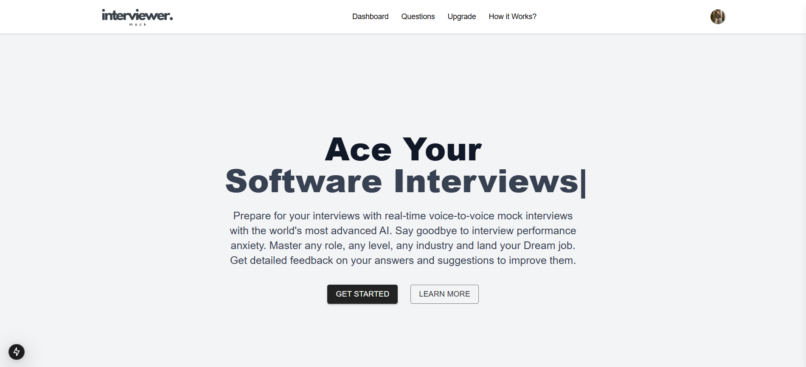
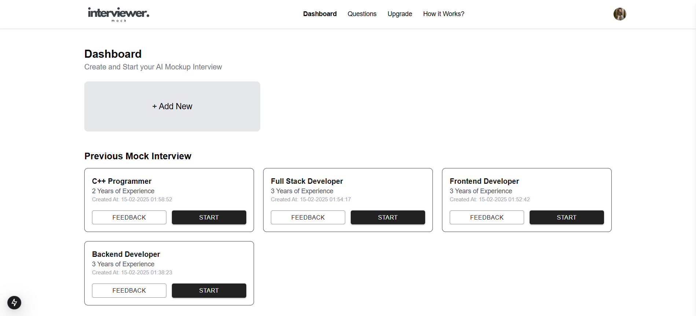
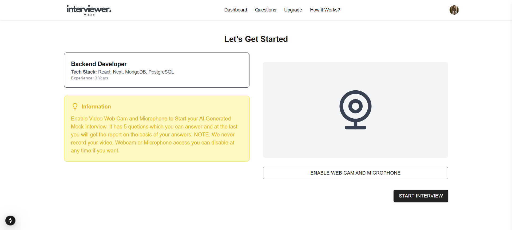
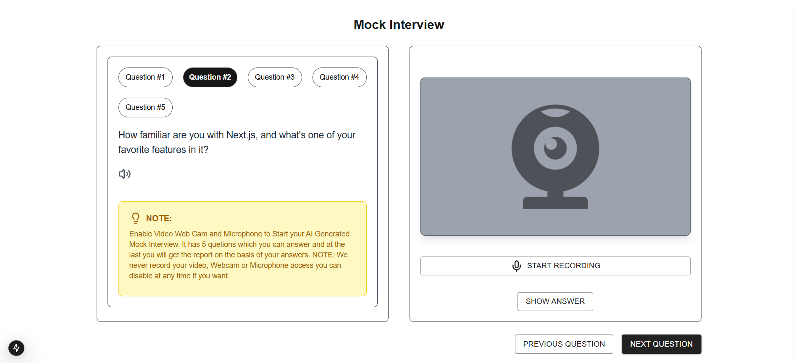

# 🏆 Mock Interview AI - Ace Your Software Interviews



🚀 **Mock Interview AI** is an advanced AI-driven platform designed to **help candidates prepare for real-world software interviews** through interactive, voice-based mock interviews. Get real-time feedback, master technical and behavioral questions, and boost your confidence to land your dream job.

The app will be available at [Live Link](https://ai-mock-interviewer-gauravvbh.vercel.app/) 🎉.

---

## 📖 Table of Contents

- [🌟 Features](#-features)
- [📸 Screenshots](#-screenshots)
- [🛠 Installation](#-installation)
- [🚀 Usage](#-usage)
- [🛒 Subscription Plans](#-subscription-plans)

---

## 🌟 Features

✅ **AI-Powered Interviews** – Simulate real interviews with AI-driven responses.  
✅ **Real-Time Feedback** – Get instant feedback on answers & improvements.  
✅ **Voice-to-Voice Interaction** – AI converses just like a real interviewer.  
✅ **Multiple Difficulty Levels** – Beginner, Intermediate, and Expert interview modes.  
✅ **Role-Based Questions** – Choose Software Engineer, Data Scientist, PM, and more.  
✅ **Dark & Light Themes** – Customize the UI to match your preference.  
✅ **Payment Integration** – Upgrade to premium plans via Razorpay.  
✅ **Secure Authentication** – Powered by Clerk for login & user management.

---

## 📸 Screenshots

🔹 **Home Page**  


🔹 **Interview Page**  


🔹 **Subscription Plans**  


🔹 **Live AI Interview**  


---

## 🛠 Installation

Follow these steps to **set up the project locally**:

### 1️⃣ **Clone the repository**

```sh
git clone https://github.com/gauravvbh/AI-Mock-Interviewer.git
cd AI-Mock-Interviewer
```

### 2️⃣ **Install dependencies**

```sh
npm install
```

### **3️⃣ Set up environment variables**

Create a **.env.local** file and add the following:

```env
NEXT_PUBLIC_CLERK_PUBLISHABLE_KEY=
CLERK_SECRET_KEY=
NEXT_PUBLIC_CLERK_SIGN_IN_URL=/sign-in
NEXT_PUBLIC_CLERK_SIGN_UP_URL=/sign-up
NEXT_PUBLIC_DATABASE_URL=
NEXT_PUBLIC_GEMINI_API_KEY=
NEXT_PUBLIC_INTERVIEW_QUESTIONS_COUNT=5
NEXT_PUBLIC_INFORMATION='Enable Video Web Cam and Microphone to Start your AI Generated Mock Interview. It has 5 quetions which you can answer and at the last you will get the report on the basis of your answers. NOTE: We never record your video, Webcam or Microphone access you can disable at any time if you want.'
NEXT_PUBLIC_RAZORPAY_KEY_ID=
RAZORPAY_KEY_SECRET=
```

### **4️⃣ Run the development server**

```sh
npm run dev
```

## 🚀**Usage**

### 1️⃣ Sign Up & Log In

- Register using Clerk authentication (Google, GitHub, or Email).
- Your data is securely stored in the database.

### 2️⃣ Start a Mock Interview

- Choose job role (Software Engineer, Data Scientist, etc.).
- Select difficulty level (Easy, Medium, Hard).
- Start an AI-driven voice interview.

### 3️⃣ Upgrade to a Paid Plan

- Free Plan: Basic interview questions.
- Monthly Plan: Advanced AI features & analytics.
- Yearly Plan: Unlimited interviews & premium feedback.

### 4️⃣ Track Performance

- View detailed feedback on answers.
- Improve based on AI suggestions.

## **🛒 Subscription Plans**

We offer three subscription tiers:

| Plan    | Price (per month) | Features                                                                                                                                                                   |
| ------- | ----------------- | -------------------------------------------------------------------------------------------------------------------------------------------------------------------------- |
| Free    | ₹0                | Create 3 Mock Interviews, Unlimited Retake Interview                                                                                                                       |
| Monthly | ₹100              | Create 3 Mock Interviews, Unlimited Retake Interview, Practice Questions, Email Support                                                                                    |
| Yearly  | 700               | Unlimited Mock Interviews, Unlimited, Retake Interview, Practice Questions, Email Support, One o One, Mentor Support, Resume Analyzer and Builder, Resume based interviews |

Payments are securely handled using **Razorpay**.
